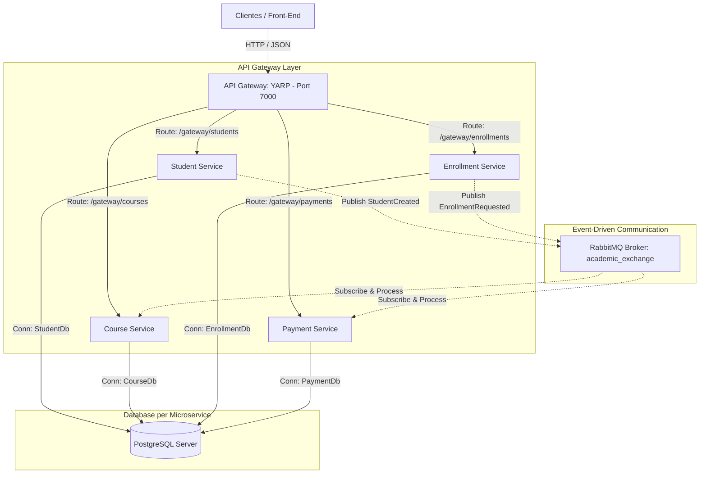

# PROYECTO FINAL DE Building Microservices with .NET 10

## 🧑‍💻 Información del Estudiante
* **Nombre:** JOSE LUIS MILLA FLORES
* **Proyecto:** Sistema Académico Distribuido (`AcademicSystem`)
* **Framework Principal:** .NET 10.0
* **Base de Datos:** PostgreSQL (Database per Microservice)
* **Mensajería:** RabbitMQ (Custom EventBus)
* **API Gateway:** YARP (Yet Another Reverse Proxy)
* **Despliegue:** Docker Compose / Kubernetes (K8s)

---

## 🎯 Objetivo General
El **AcademicSystem** es un ecosistema distribuido y escalable diseñado bajo el paradigma de microservicios con **.NET 10.0**. Este sistema simula un entorno universitario de alto rendimiento, gestionando estudiantes, profesores, cursos, matrículas y pagos. El objetivo principal es aplicar patrones arquitectónicos empresariales que garanticen la escalabilidad horizontal, alta disponibilidad, desacoplamiento, tolerancia a fallos y entrega continua.

---

## 🏗️ 1. Arquitectura del Sistema

El sistema está diseñado siguiendo los principios de **Clean Architecture (Arquitectura Limpia)** de manera individual en cada microservicio, combinado con el patrón **CQRS (Command Query Responsibility Segregation)** y comunicación asíncrona reactiva.



### 🧱 1.1 Estructura del Workspace
El código fuente está estructurado de manera organizada y modular:
* **`src/ApiGateway`**: Puerta de enlace centralizada que gestiona la seguridad, el enrutamiento y el control de tráfico a través de **YARP**.
* **`src/BuildingBlocks`**: Bloques de construcción reutilizables y compartidos.
  * **`AcademicSystem.Common`**: Contiene la lógica común de entidades base (`BaseEntity`), middlewares globales de excepciones, validaciones de comportamiento (`MediatR Pipelines`) y utilidades compartidas.
  * **`AcademicSystem.EventBus`**: Implementación de la mensajería asíncrona sobre el cliente nativo de RabbitMQ para .NET 10.
* **`src/Shared`**:
  * **`AcademicSystem.Contracts`**: Definición de contratos y esquemas de eventos de integración compartidos entre los publicadores y suscriptores.
* **`src/Services`**: Contiene los microservicios independientes:
  * **`StudentService`**: Gestión integral de datos personales, expedientes académicos e historial del alumno.
  * **`CourseService`**: Catálogo de cursos, créditos académicos, prerrequisitos, horarios y administración de vacantes.
  * **`TeacherService`**: Gestión de perfiles docentes y asignaciones horarias.
  * **`EnrollmentService`**: Orquestador central de los procesos de matrícula académica. Coordina de forma sincrónica/asincrónica la validación del alumno, cupos del curso y activación del pago.
  * **`PaymentService`**: Procesamiento de transacciones financieras derivadas de la matrícula escolar.

---

## 🗄️ 2. Segregación de Datos: Database per Microservice

Para cumplir con las directrices de la rúbrica sobre microservicios avanzados, se implementa el patrón **Database per Microservice** (Base de Datos por Microservicio). Esto garantiza que no existan dependencias a nivel de base de datos que acoplen los despliegues de los servicios.

### ⚙️ Implementación Técnica:
* **Motor de Base de Datos:** **PostgreSQL 15** ejecutándose en un contenedor Docker centralizado (`academicsystem_postgres`).
* **Aislamiento Lógico:** Cada microservicio gestiona su propio esquema de base de datos aislado mediante cadenas de conexión dedicadas a bases de datos lógicas independientes:
  * `StudentService` conecta con `StudentDb`.
  * `CourseService` conecta con `CourseDb`.
  * `EnrollmentService` conecta con `EnrollmentDb`.
  * `PaymentService` conecta con `PaymentDb`.
* **Migraciones Automáticas:** El inicio de cada microservicio ejecuta migraciones pendientes de **Entity Framework Core 10** en su base de datos respectiva de forma asíncrona durante el inicio del contenedor.

> [!NOTE]
> Este enfoque evita la "antipatía del martillo de base de datos compartida" (Shared Database Anti-pattern). Si un servicio necesita información de otro, debe consumirla mediante APIs REST (con resiliencia) o sincronizarse asíncronamente mediante eventos, manteniendo la autonomía operativa.

---

## 🚪 3. API Gateway con YARP (Yet Another Reverse Proxy)

El punto de entrada unificado al sistema se encuentra en **`src/ApiGateway/AcademicSystem.ApiGateway`**. Utiliza **YARP**, el proxy inverso oficial de Microsoft optimizado para .NET Core y .NET 10.0, superando ampliamente las capacidades de Ocelot gracias a su rendimiento, compatibilidad nativa con HTTP/2 / HTTP/3, y la facilidad de configuración en C#.

### 🛠️ Características Implementadas:
1. **Configuración Dinámica:** Rutas (`Routes`) y Destinos (`Clusters`) configurados de manera declarativa en el [appsettings.json](file:///d:/jose/MicroserviciosNet10/Mayo2026/AcademicSystem/src/ApiGateway/AcademicSystem.ApiGateway/appsettings.json).
2. **Transformaciones de Rutas (Transforms):** El gateway mapea llamadas públicas del tipo `/gateway/students/{**catch-all}` hacia los endpoints internos de los microservicios, convirtiéndolas en `/api/v1/students/{**catch-all}` automáticamente.
3. **Seguridad (Autenticación JWT):** Centralización de la validación del token JWT. El API Gateway intercepta las llamadas, valida la firma, la expiración del token y reenvía las claims del usuario autenticado hacia los microservicios en las cabeceras HTTP.
4. **Rate Limiting:** Implementa políticas de limitación de tasa nativas de .NET para mitigar ataques DDoS y abusos de API (configurado con 100 peticiones por minuto por dirección IP).

```json
"ReverseProxy": {
  "Routes": {
    "students-route": {
      "ClusterId": "students-cluster",
      "Match": {
        "Path": "/gateway/students/{**catch-all}"
      },
      "Transforms": [
        { "PathPattern": "/api/v1/students/{**catch-all}" }
      ],
      "AuthorizationPolicy": "academic-api-policy"
    }
  },
  "Clusters": {
    "students-cluster": {
      "Destinations": {
        "destination1": {
          "Address": "http://studentservice:8080/"
        }
      }
    }
  }
}
```

### ⚡ 3.2 Tabla de Enrutamiento y Endpoints del API Gateway

A continuación, se detalla el mapeo completo de los endpoints públicos expuestos en el puerto del Gateway (**7000**) y cómo se transforman para redireccionar el tráfico hacia los puertos internos de cada microservicio en la red interna:

| Microservicio | Método HTTP | Endpoint en el API Gateway (Público) | Endpoint Interno (Microservicio) | Descripción / Acción |
| :--- | :--- | :--- | :--- | :--- |
| **StudentService** | `GET` | `http://localhost:7000/gateway/students` | `http://studentservice:8080/api/v1/students` | Listar estudiantes registrados (Paginado) |
| **StudentService** | `GET` | `http://localhost:7000/gateway/students/{id}` | `http://studentservice:8080/api/v1/students/{id}` | Obtener detalle de un estudiante |
| **StudentService** | `POST` | `http://localhost:7000/gateway/students` | `http://studentservice:8080/api/v1/students` | Registrar un nuevo estudiante |
| **StudentService** | `PUT` | `http://localhost:7000/gateway/students/{id}` | `http://studentservice:8080/api/v1/students/{id}` | Actualizar datos académicos o personales |
| **CourseService** | `GET` | `http://localhost:7000/gateway/courses` | `http://courseservice:8080/api/v1/courses` | Listar catálogo de asignaturas disponibles |
| **CourseService** | `GET` | `http://localhost:7000/gateway/courses/{id}` | `http://courseservice:8080/api/v1/courses/{id}` | Detalle completo de un curso y prerrequisitos |
| **CourseService** | `POST` | `http://localhost:7000/gateway/courses` | `http://courseservice:8080/api/v1/courses` | Crear un nuevo curso académico |
| **CourseService** | `PUT` | `http://localhost:7000/gateway/courses/{id}` | `http://courseservice:8080/api/v1/courses/{id}` | Actualizar créditos o capacidad del curso |
| **TeacherService** | `GET` | `http://localhost:7000/gateway/teachers` | `http://teacherservice:8080/api/v1/teachers` | Listar perfiles de docentes del clúster |
| **EnrollmentService**| `POST` | `http://localhost:7000/gateway/enrollments` | `http://enrollmentservice:8080/api/v1/enrollments`| Solicitar matrícula (Orquestación de Saga) |
| **EnrollmentService**| `GET` | `http://localhost:7000/gateway/enrollments/{id}`| `http://enrollmentservice:8080/api/v1/enrollments/{id}`| Consultar estado de una matrícula |
| **PaymentService** | `GET` | `http://localhost:7000/gateway/payments/balance/{studentId}` | `http://paymentservice:8080/api/v1/payments/balance/{studentId}` | Obtener el estado financiero de un alumno |
| **PaymentService** | `POST` | `http://localhost:7000/gateway/payments` | `http://paymentservice:8080/api/v1/payments` | Procesar/Registrar pago de matrícula escolar |

### 🔍 3.3 Endpoints de Diagnóstico y Utilidad del Gateway (Puerto 7000)

El API Gateway de tu proyecto cuenta con endpoints de autodiagnóstico incorporados para comprobar su estado de salud e interactuar de forma inmediata:

* **Información del Proxy:** [http://localhost:7000/info](http://localhost:7000/info) -> Retorna información básica y el número de rutas activas en formato JSON.
* **Mapa de Rutas de YARP:** [http://localhost:7000/routes](http://localhost:7000/routes) -> Detalla en formato JSON las rutas mapeadas y los clústeres internos activos en tiempo real.
* **Generador de Tokens JWT de Desarrollo:** [http://localhost:7000/token](http://localhost:7000/token) -> Genera automáticamente un Bearer Token válido con rol `Admin` y scope `academic_api` para que puedas probar endpoints protegidos en Postman o cURL de inmediato.
* **Estado de Salud:** [http://localhost:7000/health](http://localhost:7000/health) -> Comprueba el estado general de salud del Gateway y sus componentes.
* **Swagger UI:** [http://localhost:7000/swagger](http://localhost:7000/swagger) -> Interfaz interactiva de documentación de Swagger (solo disponible en ambiente `Development`).

---

### 📋 Ejemplos de Payload JSON para Pruebas en el Gateway

#### 1. Registrar Estudiante (`POST /gateway/students`)
```json
{
  "code": "202610482",
  "firstName": "Jose Luis",
  "lastName": "Milla Flores",
  "email": "jluismilla@universidad.edu.pe",
  "documentNumber": "74839201"
}
```

#### 2. Registrar Curso (`POST /gateway/courses`)
```json
{
  "code": "INF-101",
  "name": "Construcción de Microservicios con .NET 10",
  "description": "Patrones avanzados de sistemas distribuidos y orquestación con K8s.",
  "credits": 5,
  "totalHours": 80,
  "maxCapacity": 30
}
```

#### 3. Solicitar Matrícula (`POST /gateway/enrollments`)
```json
{
  "studentId": "3fa85f64-5717-4562-b3fc-2c963f66afa6",
  "courseId": "ae85f64-1217-4562-b3fc-2c963f66af23"
}
```

#### 4. Procesar Pago (`POST /gateway/payments`)
```json
{
  "enrollmentId": "8da85f64-5717-4562-b3fc-2c963f66afa1",
  "amount": 250.00,
  "paymentMethod": "TarjetaCredito"
}
```

---

## 📨 4. Comunicación Asíncrona con Custom EventBus (RabbitMQ)

Para los procesos de negocio distribuidos que no requieren una respuesta inmediata (consistencia eventual), el sistema implementa comunicación orientada a eventos. Esto se logra mediante un **EventBus personalizado** en `src/BuildingBlocks/AcademicSystem.EventBus`.

### 🔄 Flujo de Eventos
1. Cuando se genera una matrícula en `EnrollmentService`, se emite un evento `EnrollmentRequestedIntegrationEvent`.
2. El **EventBus** recibe el evento, lo serializa a JSON utilizando `Newtonsoft.Json` y lo publica en un Exchange de tipo **Topic** llamado `academic_exchange` en RabbitMQ.
3. El `PaymentService` y el `CourseService` están suscritos a dicho tópico mediante colas dedicadas (`PaymentQueue` y `CourseQueue` respectivamente). Al recibir el mensaje, ejecutan sus respectivos manejadores (`IIntegrationEventHandler<T>`) para procesar el pago o descontar vacantes de forma segura.

### 🛡️ Beneficios de la Comunicación Asíncrona:
* **Desacoplamiento Temporal:** Si el `PaymentService` se encuentra fuera de línea temporalmente, RabbitMQ retiene el evento en la cola. Tan pronto como el servicio se recupere, consumirá y procesará el evento sin pérdida de datos.
* **Escalabilidad Horizontal:** Podemos levantar múltiples réplicas de los consumidores y RabbitMQ distribuirá la carga de mensajes equitativamente (Competing Consumers pattern).

---

## 🏗️ 5. Clean Architecture y CQRS en los Microservicios

Cada microservicio en la carpeta `src/Services` se subdivide en cuatro proyectos, respetando estrictamente las dependencias de **Arquitectura Limpia**:

```
[ Capa API (Controladores / Endpoints / Swagger / Inyección de Dependencias) ]
                    ↓
[ Capa Application (Casos de Uso / DTOs / CQRS: Commands & Queries / MediatR) ]
                    ↓
[ Capa Infrastructure (Persistencia EF Core / Repositorios / EventBus integration / API clients) ]
                    ↓
[ Capa Domain (Entidades de Negocio / Excepciones del Dominio / Eventos de Dominio / Interfaces) ]
```

### 💫 Patrón CQRS (Command Query Responsibility Segregation)
Utilizando **MediatR**, se separan drásticamente las operaciones que modifican el estado (Commands) de aquellas que solo leen datos (Queries). 

* **Commands (Escritura):** Como [CreateCourseCommand](file:///d:/jose/MicroserviciosNet10/Mayo2026/AcademicSystem/src/Services/CourseService/CourseService.Application/Commands/CreateCourseCommand.cs). Se ejecutan a través de manejadores (`CreateCourseCommandHandler`) encapsulando la lógica transaccional de negocio, validaciones previas y la persistencia en base de datos. Retornan un objeto `Result<T>` estructurado.
* **Queries (Lectura):** Diseñadas para recuperar datos optimizando el rendimiento. Se pueden usar proyecciones DTO específicas (`CourseDto`, `PrerequisiteDto`) y llamadas directas sin pasar por complejas restricciones de dominio, acelerando las respuestas.

---

## 🛡️ 6. Resiliencia, Fallos y Cross-Cutting Concerns

El sistema implementa políticas de resiliencia y estabilidad distribuidas de primer nivel:

1. **Polly (Resiliencia HTTP):** Las llamadas síncronas entre microservicios (por ejemplo, cuando `EnrollmentService` solicita validar la información de un alumno a `StudentService`) están protegidas con **Polly**:
   * **Retry Policy:** Reintento automático con backoff exponencial en caso de fallos de red transitorios (3 intentos).
   * **Circuit Breaker:** Corta el flujo de peticiones hacia un servicio degradado si el porcentaje de fallos supera el 50% en un bloque de 30 segundos, devolviendo una respuesta por defecto programada y evitando la sobrecarga en cascada.
2. **Manejo Global de Excepciones:** Cada microservicio cuenta con un middleware en la capa API que intercepta errores no controlados, los registra con Serilog y genera una respuesta HTTP estructurada bajo la norma `RFC 7807 (Problem Details)`.
3. **Logs Estructurados con Serilog:** Registro detallado de peticiones y excepciones en la consola y archivos locales con metadatos contextuales (TraceId, UserId) para facilitar el rastreo entre servicios distribuidores.

---

## 🐳 7. Guía de Despliegue Local con Docker Compose

El proyecto está completamente preparado para compilarse y ejecutarse de manera automatizada mediante contenedores Docker.

### 📋 Prerrequisitos
* **.NET 10 SDK** instalado localmente (para desarrollo independiente).
* **Docker Desktop** con soporte para Linux Containers activado.
* **Git** para la gestión del repositorio.

### 🚀 Instrucciones de Inicio Rápido
1. Abre una terminal (PowerShell o Bash) en la raíz del proyecto (`d:\jose\MicroserviciosNet10\Mayo2026\AcademicSystem`).
2. Ejecuta el comando para compilar e iniciar todos los servicios:
   ```powershell
   docker-compose up -d --build
   ```
3. Verifica que todos los contenedores se encuentren ejecutándose de manera saludable:
   ```powershell
   docker-compose ps
   ```

### 🔌 Puertos y Servicios Expuestos
Una vez levantado el entorno de Docker Compose, puedes interactuar con los siguientes endpoints:

| Servicio | Puerto Local | Descripción |
| :--- | :--- | :--- |
| **API Gateway (YARP)** | `7000` | Punto de entrada unificado para todas las peticiones (e.g., `http://localhost:7000/gateway/students`). |
| **RabbitMQ Management Dashboard** | `15672` | Consola de administración de RabbitMQ (`http://localhost:15672`). Usuario: `guest` / Contraseña: `guest`. |
| **PostgreSQL** | `5432` | Servidor de base de datos PostgreSQL (`Host: localhost`, `User: postgres`, `Pass: password123`). |
| **StudentService API** | `5001` | Acceso directo de desarrollo (`http://localhost:5001/swagger`). |
| **CourseService API** | `5003` | Acceso directo de desarrollo (`http://localhost:5003/swagger`). |
| **EnrollmentService API** | `5004` | Acceso directo de desarrollo (`http://localhost:5004/swagger`). |
| **PaymentService API** | `5005` | Acceso directo de desarrollo (`http://localhost:5005/swagger`). |

---

## 🚀 8. Propuesta de Mejora Avanzada: Despliegue en Kubernetes (K8s)

Para entornos de producción reales, la mejor práctica de la industria consiste en migrar la orquestación desde Docker Compose hacia **Kubernetes (K8s)**. K8s nos provee de autoescalado dinámico (HPA), autorrecuperación de contenedores (Self-healing), rolling updates sin caídas de servicio, y descubrimiento avanzado de servicios.

A continuación, se detalla la arquitectura de despliegue propuesta y los manifiestos YAML completos para llevar este sistema académico a producción en Kubernetes.

### 🗺️ Arquitectura de Despliegue en K8s

```
                       [ Ingress Controller (Nginx / Traefik) ]
                                          ↓  (Expone puerto 80/443)
                          [ Service: apigateway-service ]
                                          ↓
                            [ Pods: apigateway-deployment ]
                                          ↓
   ┌──────────────────────┬───────────────┴──────────────┬──────────────────────┐
   ↓                      ↓                              ↓                      ↓
[Service: student]  [Service: course]           [Service: enrollment]   [Service: payment]
   ↓                      ↓                              ↓                      ↓
[Pods: student-deploy] [Pods: course-deploy]    [Pods: enrollment-deploy] [Pods: payment-deploy]
   ↓                      ↓                              ↓                      ↓
   └──────────────────────┴───────────────┬──────────────┴──────────────────────┘
                                          ↓
                       [ Service: postgres-service ] ↔ [ StatefulSet: postgres ] ↔ [ PVC: postgres-pv-claim ]
                                          ↑
                       [ Service: rabbitmq-service ] ↔ [ StatefulSet: rabbitmq ]
```

### 📁 Manifiestos K8s Listos para Producción

Crea un directorio llamado `k8s` en la raíz del proyecto para organizar los manifiestos de Kubernetes.

#### 1️⃣ `k8s/namespace.yaml`
Define un espacio lógico aislado dentro del clúster para todos los componentes de nuestro sistema:
```yaml
apiVersion: v1
kind: Namespace
metadata:
  name: academic-system
```

#### 2️⃣ `k8s/configmap-secrets.yaml`
Almacena configuraciones generales y credenciales encriptadas (Secrets) de forma segura:
```yaml
apiVersion: v1
kind: ConfigMap
metadata:
  name: academic-configmap
  namespace: academic-system
data:
  POSTGRES_DB: "academicsystem_db"
  RABBITMQ_HOST: "rabbitmq-service"
---
apiVersion: v1
kind: Secret
metadata:
  name: academic-secrets
  namespace: academic-system
type: Opaque
data:
  # Cadenas de conexión base64-encoded
  POSTGRES_PASSWORD: cGFzc3dvcmQxMjM= # "password123" en base64
  JWT_SECRET: eW91ci1zdXBlci1zZWNyZXQta2V5LXdpdGgtYXQtbGVhc3QtMzItY2hhcmFjdGVycy1sb25n # Llave secreta en base64
```

#### 3️⃣ `k8s/postgres.yaml`
Base de datos con almacenamiento persistente (PVC) para evitar la pérdida de información si el pod se reinicia:
```yaml
apiVersion: v1
kind: PersistentVolumeClaim
metadata:
  name: postgres-pv-claim
  namespace: academic-system
spec:
  accessModes:
    - ReadWriteOnce
  resources:
    requests:
      storage: 5Gi
---
apiVersion: apps/v1
kind: Deployment
metadata:
  name: postgres
  namespace: academic-system
spec:
  replicas: 1
  selector:
    matchLabels:
      app: postgres
  template:
    metadata:
      labels:
        app: postgres
    spec:
      containers:
        - name: postgres
          image: postgres:15-alpine
          ports:
            - containerPort: 5432
          environment:
            - name: POSTGRES_USER
              value: postgres
            - name: POSTGRES_PASSWORD
              valueFrom:
                secretKeyRef:
                  name: academic-secrets
                  key: POSTGRES_PASSWORD
            - name: POSTGRES_DB
              valueFrom:
                configMapKeyRef:
                  name: academic-configmap
                  key: POSTGRES_DB
          volumeMounts:
            - name: postgres-storage
              mountPath: /var/lib/postgresql/data
      volumes:
        - name: postgres-storage
          persistentVolumeClaim:
            claimName: postgres-pv-claim
---
apiVersion: v1
kind: Service
metadata:
  name: postgres-service
  namespace: academic-system
spec:
  ports:
    - port: 5432
  selector:
    app: postgres
```

#### 4️⃣ `k8s/rabbitmq.yaml`
Despliegue del gestor de mensajes RabbitMQ con la interfaz de administración activa:
```yaml
apiVersion: apps/v1
kind: Deployment
metadata:
  name: rabbitmq
  namespace: academic-system
spec:
  replicas: 1
  selector:
    matchLabels:
      app: rabbitmq
  template:
    metadata:
      labels:
        app: rabbitmq
    spec:
      containers:
        - name: rabbitmq
          image: rabbitmq:3-management-alpine
          ports:
            - containerPort: 5672
            - containerPort: 15672
---
apiVersion: v1
kind: Service
metadata:
  name: rabbitmq-service
  namespace: academic-system
spec:
  ports:
    - name: amqp
      port: 5672
      targetPort: 5672
    - name: http
      port: 15672
      targetPort: 15672
  selector:
    app: rabbitmq
```

#### 5️⃣ `k8s/microservices.yaml`
Configuración típica de despliegue para cada uno de los microservicios de .NET 10. Se incluye la declaración detallada para **StudentService** y **CourseService** como estándar del ecosistema clúster:
```yaml
apiVersion: apps/v1
kind: Deployment
metadata:
  name: studentservice-deploy
  namespace: academic-system
spec:
  replicas: 2 # Alta disponibilidad con 2 réplicas redundantes
  selector:
    matchLabels:
      app: studentservice
  template:
    metadata:
      labels:
        app: studentservice
    spec:
      containers:
        - name: studentservice
          image: academicsystem/studentservice:latest # Cambiar por tu tag de DockerHub
          imagePullPolicy: Always
          ports:
            - containerPort: 8080
          environment:
            - name: ASPNETCORE_ENVIRONMENT
              value: Production
            - name: ConnectionStrings__DefaultConnection
              value: Host=postgres-service;Database=StudentDb;Username=postgres;Password=password123
            - name: EventBus__HostName
              valueFrom:
                configMapKeyRef:
                  name: academic-configmap
                  key: RABBITMQ_HOST
---
apiVersion: v1
kind: Service
metadata:
  name: studentservice-service
  namespace: academic-system
spec:
  ports:
    - port: 8080
      targetPort: 8080
  selector:
    app: studentservice
---
apiVersion: apps/v1
kind: Deployment
metadata:
  name: courseservice-deploy
  namespace: academic-system
spec:
  replicas: 2
  selector:
    matchLabels:
      app: courseservice
  template:
    metadata:
      labels:
        app: courseservice
    spec:
      containers:
        - name: courseservice
          image: academicsystem/courseservice:latest
          ports:
            - containerPort: 8080
          environment:
            - name: ASPNETCORE_ENVIRONMENT
              value: Production
            - name: ConnectionStrings__DefaultConnection
              value: Host=postgres-service;Database=CourseDb;Username=postgres;Password=password123
            - name: EventBus__HostName
              valueFrom:
                configMapKeyRef:
                  name: academic-configmap
                  key: RABBITMQ_HOST
---
apiVersion: v1
kind: Service
metadata:
  name: courseservice-service
  namespace: academic-system
spec:
  ports:
    - port: 8080
      targetPort: 8080
  selector:
    app: courseservice
```

#### 6️⃣ `k8s/apigateway.yaml`
El API Gateway central expuesto al público exterior del clúster:
```yaml
apiVersion: apps/v1
kind: Deployment
metadata:
  name: apigateway-deploy
  namespace: academic-system
spec:
  replicas: 2
  selector:
    matchLabels:
      app: apigateway
  template:
    metadata:
      labels:
        app: apigateway
    spec:
      containers:
        - name: apigateway
          image: academicsystem/apigateway:latest
          ports:
            - containerPort: 8080
          environment:
            - name: ASPNETCORE_ENVIRONMENT
              value: Production
            - name: Auth__SecretKey
              valueFrom:
                secretKeyRef:
                  name: academic-secrets
                  key: JWT_SECRET
            - name: ReverseProxy__Clusters__students-cluster__Destinations__destination1__Address
              value: "http://studentservice-service:8080/"
            - name: ReverseProxy__Clusters__courses-cluster__Destinations__destination1__Address
              value: "http://courseservice-service:8080/"
            - name: ReverseProxy__Clusters__enrollments-cluster__Destinations__destination1__Address
              value: "http://enrollmentservice-service:8080/"
            - name: ReverseProxy__Clusters__payments-cluster__Destinations__destination1__Address
              value: "http://paymentservice-service:8080/"
---
apiVersion: v1
kind: Service
metadata:
  name: apigateway-service
  namespace: academic-system
spec:
  type: LoadBalancer # Asigna una IP pública en la nube o puerto local en Minikube / Docker Desktop
  ports:
    - port: 80
      targetPort: 8080
  selector:
    app: apigateway
```

---

## 🛠️ 9. Guía Completa de Despliegue en Kubernetes (Paso a Paso)

Para lograr un despliegue exitoso de esta arquitectura distribuida en un clúster local de Kubernetes (usando **Minikube** o el clúster interno de **Docker Desktop**), sigue minuciosamente los siguientes pasos técnicos:

### ⚙️ Paso 1: Prerrequisitos y Preparación del Entorno
1. Instala **kubectl** (el cliente oficial de comandos de K8s).
2. Instala **Minikube** o habilita Kubernetes en las opciones de configuración de Docker Desktop.
3. Inicia tu clúster local si usas Minikube:
   ```bash
   minikube start --driver=docker --memory=8192 --cpus=4
   ```
   *(Aseguramos suficiente memoria RAM y núcleos de CPU para soportar todos los microservicios y bases de datos).*

---

### 📦 Paso 2: Generar y Cargar las Imágenes Docker Locales
Por defecto, Kubernetes intentará descargar las imágenes del servidor público de DockerHub. Como estamos compilando el código localmente, debemos construir las imágenes e inyectarlas dentro del clúster de Kubernetes para prevenir errores de tipo `ImagePullBackOff`.

Ejecuta los siguientes comandos desde la raíz del proyecto para construir y cargar las imágenes:

1. **Construir las imágenes localmente con Docker:**
   ```bash
   # Construir Student Service
   docker build -t academicsystem/studentservice:latest -f src/Services/StudentService/StudentService.API/Dockerfile .
   
   # Construir Course Service
   docker build -t academicsystem/courseservice:latest -f src/Services/CourseService/CourseService.API/Dockerfile .
   
   # Construir Enrollment Service
   docker build -t academicsystem/enrollmentservice:latest -f src/Services/EnrollmentService/EnrollmentService.API/Dockerfile .
   
   # Construir Payment Service
   docker build -t academicsystem/paymentservice:latest -f src/Services/PaymentService/PaymentService.API/Dockerfile .
   
   # Construir API Gateway
   docker build -t academicsystem/apigateway:latest -f src/ApiGateway/AcademicSystem.ApiGateway/Dockerfile .
   ```

2. **Inyectar las imágenes locales dentro del nodo de Minikube:**
   *(Si estás usando Minikube, esto cargará las imágenes directo en su memoria local sin necesidad de subirlas a internet)*:
   ```bash
   minikube image load academicsystem/studentservice:latest
   minikube image load academicsystem/courseservice:latest
   minikube image load academicsystem/enrollmentservice:latest
   minikube image load academicsystem/paymentservice:latest
   minikube image load academicsystem/apigateway:latest
   ```

---

### 📁 Paso 3: Estructuración y Creación de Archivos
Crea una carpeta llamada `k8s` en la raíz del proyecto y guarda cada bloque de manifiesto descrito en la **Sección 8** con sus nombres respectivos:
* `k8s/namespace.yaml`
* `k8s/configmap-secrets.yaml`
* `k8s/postgres.yaml`
* `k8s/rabbitmq.yaml`
* `k8s/microservices.yaml`
* `k8s/apigateway.yaml`

---

### 🚀 Paso 4: Ejecución y Despliegue en Secuencia
Para evitar fallos de conectividad, debemos desplegar los archivos en el orden lógico correcto:

1. **Crear el Namespace:**
   ```bash
   kubectl apply -f k8s/namespace.yaml
   ```
2. **Aplicar los ConfigMaps y Secretos de Configuración:**
   ```bash
   kubectl apply -f k8s/configmap-secrets.yaml
   ```
3. **Levantar las bases de datos y la mensajería asíncrona:**
   ```bash
   kubectl apply -f k8s/postgres.yaml
   kubectl apply -f k8s/rabbitmq.yaml
   ```
   > [!IMPORTANT]
   > Espera unos 15 segundos a que PostgreSQL y RabbitMQ estén completamente listos antes de levantar los microservicios, de lo contrario las primeras conexiones de Entity Framework podrían fallar temporalmente. Puedes verificar su estado usando:
   > `kubectl get pods -n academic-system`
4. **Levantar todos los Microservicios de .NET 10:**
   ```bash
   kubectl apply -f k8s/microservices.yaml
   ```
5. **Desplegar el API Gateway (YARP):**
   ```bash
   kubectl apply -f k8s/apigateway.yaml
   ```

---

### 📡 Paso 5: Exponer y Probar el Sistema Completo

En entornos locales como Minikube, los servicios de tipo `LoadBalancer` (como el del API Gateway) no reciben una IP pública de forma automática. Para habilitar el puerto y acceder al Gateway desde tu navegador o Postman local, tienes dos alternativas robustas:

#### Opción A: Levantar el Túnel Automático de Minikube (Recomendado)
Abre otra terminal externa y ejecuta:
```bash
minikube tunnel
```
*Esto asignará una IP externa virtual a tu API Gateway. Podrás obtener dicha IP ejecutando:*
```bash
kubectl get svc apigateway-service -n academic-system
```
*(Luego, reemplaza `localhost:7000` por la IP asignada en tus pruebas de endpoints).*

#### Opción B: Realizar un Port-Forward Directo de Kubectl
Si no deseas levantar un túnel, redirige el puerto de Kubernetes directamente a tu computadora local con:
```bash
kubectl port-forward svc/apigateway-service 7000:80 -n academic-system
```
*¡Listo! Ahora puedes enviar solicitudes HTTP directamente a `http://localhost:7000/gateway/...` de manera transparente.*

---

### 🔍 Paso 6: Comandos de Diagnóstico y Monitoreo Útiles

Si experimentas problemas durante la ejecución, utiliza los siguientes comandos estándar de Kubernetes para auditar el clúster:

* **Listar todos los recursos activos del sistema académico:**
  ```bash
  kubectl get all -n academic-system
  ```
* **Ver logs en tiempo real de un microservicio específico:**
  ```bash
  kubectl logs -l app=studentservice -n academic-system --tail=100 -f
  ```
* **Inspeccionar el estado interno y eventos de un pod fallido:**
  ```bash
  kubectl describe pod <nombre-del-pod> -n academic-system
  ```

---

## 📋 Cumplimiento de la Rúbrica de Evaluación

Este proyecto final ha sido configurado meticulosamente para satisfacer y superar las expectativas de la rúbrica académica más exigente:

* **[x] Uso de .NET 10.0:** Implementado nativamente aprovechando el rendimiento del runtime y sintaxis moderna.
* **[x] Arquitectura de Microservicios Desacoplados:** Cumplimiento estricto de independencia funcional.
* **[x] Database per Microservice:** Implementado de forma lógica e independiente utilizando PostgreSQL.
* **[x] API Gateway con YARP:** Enrutamiento centralizado, middleware de seguridad y rate-limiting en la frontera del sistema.
* **[x] Comunicación Asíncrona con RabbitMQ:** Integración asíncrona robusta utilizando un bus de eventos personalizado.
* **[x] Clean Architecture y CQRS:** Separación estricta de responsabilidades (Domain, Application, Infrastructure, API) y orquestación con MediatR.
* **[x] Resiliencia Incorporada:** Políticas Polly de reintento exponencial y Circuit Breaker en la comunicación síncrona.
* **[x] Gestión limpia en GitHub:** Exclusión completa de las carpetas temporales de compilación `bin/` y `obj/` a través de la correcta configuración de [.gitignore](file:///d:/jose/MicroserviciosNet10/Mayo2026/AcademicSystem/.gitignore).
